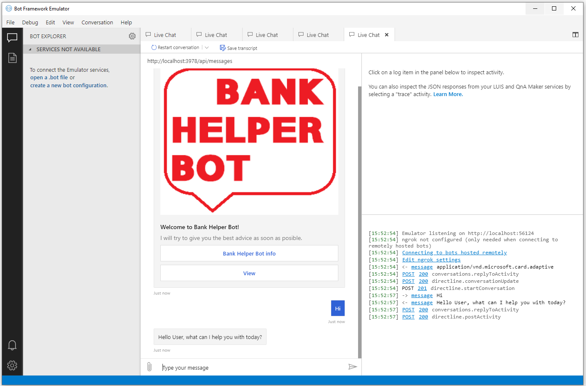
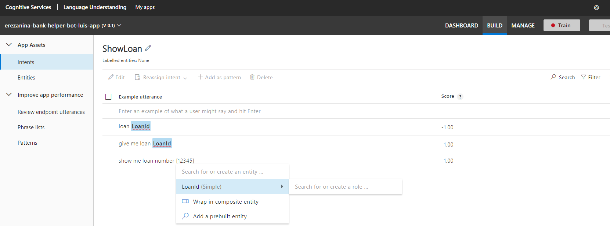
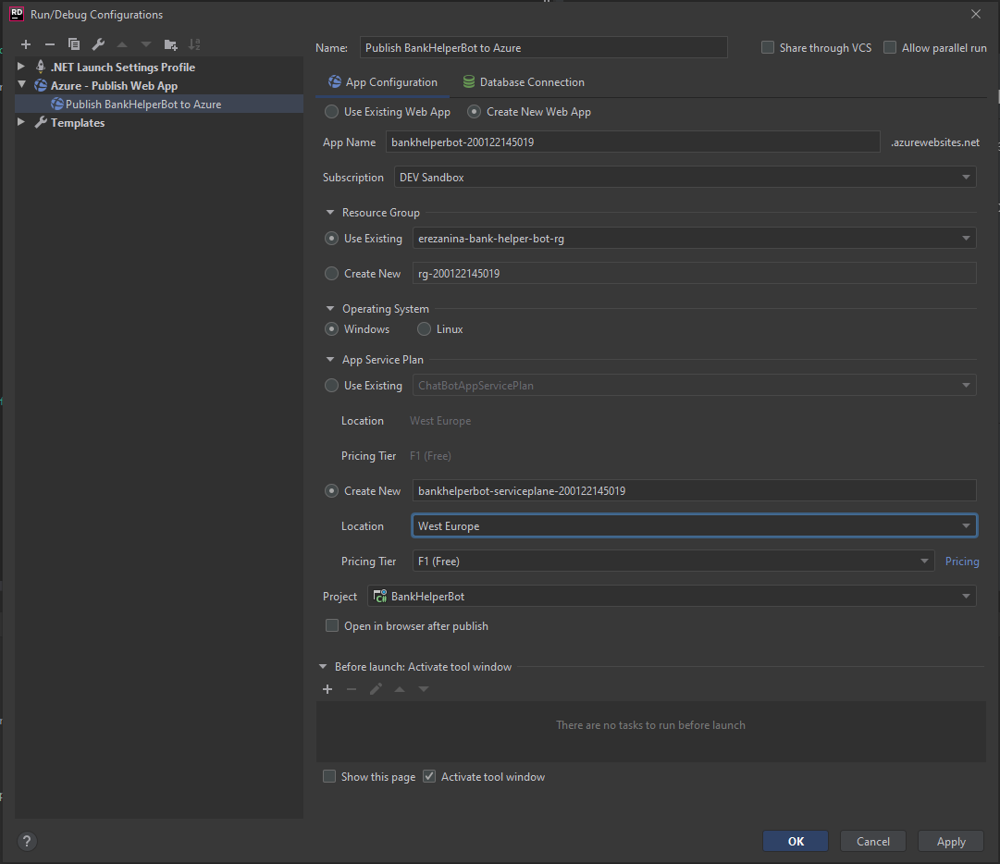

# Bank Helper Bot

Bot Framework v4 core bot sample that simulates simple Bank Helper Bot.




This bot has been created using [Bot Framework](https://dev.botframework.com), it shows how to:

- Use [LUIS](https://www.luis.ai) to implement core AI capabilities
- Implement a multi-turn conversation using Dialogs
- Handle user interruptions for such things as `Help` or `Cancel`
- Prompt for and validate requests for information from the user

### Overview

This bot uses [LUIS](https://www.luis.ai), an AI based cognitive service, to implement language understanding.

### Set up LUIS cognitive service

Create LUIS application with ```LoanId``` (simple) entity and these **Intents**:
- CalculateLoan
- ShowLoan
- ShowContact

We create several example utterances for each intents. For ```ShowLoan``` we can create utterance with ```LoanId``` entity usage. *For example left click on 12345 number and choose LoanId below:*



The LUIS language model setup, training, and application configuration steps can be found [here](https://docs.microsoft.com/en-us/azure/bot-service/bot-builder-howto-v4-luis?view=azure-bot-service-4.0&tabs=cs).
- LuisAppId - *Manage* > *Application Information* > *Application ID*
- LuisAPIKey - *Manage* > *Azure Resources* > *[Your cognitive service]* > *Primary key*
- LuisAPIHostName - *Manage* > *Azure Resources* > *[Your cognitve service]* > *Endpoint Url*


### Create a LUIS Application to enable language understanding

The LUIS model for this example can be found under `CognitiveModels/BankHelper.json`.

Once you created the LUIS model, update `appsettings.json` with your `LuisAppId`, `LuisAPIKey` and `LuisAPIHostName`.

```json
  "LuisAppId": "Your LUIS App Id",
  "LuisAPIKey": "Your LUIS Subscription key here",
  "LuisAPIHostName": "Your LUIS App region here (i.e: westus.api.cognitive.microsoft.com)"
```

If you want use `appsettings.Develompemnt.json` you must set **ASPNETCORE_ENVIRONMENT** variable in *Properties* >  *launchSettings.json* > *BankHelperBot* profile.

```
"environmentVariables": {
        "ASPNETCORE_ENVIRONMENT": "Development"
      }
``` 

## Testing the bot using Bot Framework Emulator

[Bot Framework Emulator](https://github.com/microsoft/botframework-emulator) is a desktop application that allows bot developers to test and debug their bots on localhost or running remotely through a tunnel.

- Install the Bot Framework Emulator version 4.3.0 or greater from [here](https://github.com/Microsoft/BotFramework-Emulator/releases)

### Connect to the bot using Bot Framework Emulator

- Launch Bot Framework Emulator
- File -> Open Bot
- Enter a Bot URL of `http://localhost:3978/api/messages`

## Deploy the bot to Azure

- [Deploy your bot to Azure](https://aka.ms/azuredeployment)

My way:

1. Deploy via JetBrains Rider


2. Create bot Channels Registration
 - [Register a bot with Azure Bot Service](https://docs.microsoft.com/cs-cz/azure/bot-service/bot-service-quickstart-registration?view=azure-bot-service-3.0)


